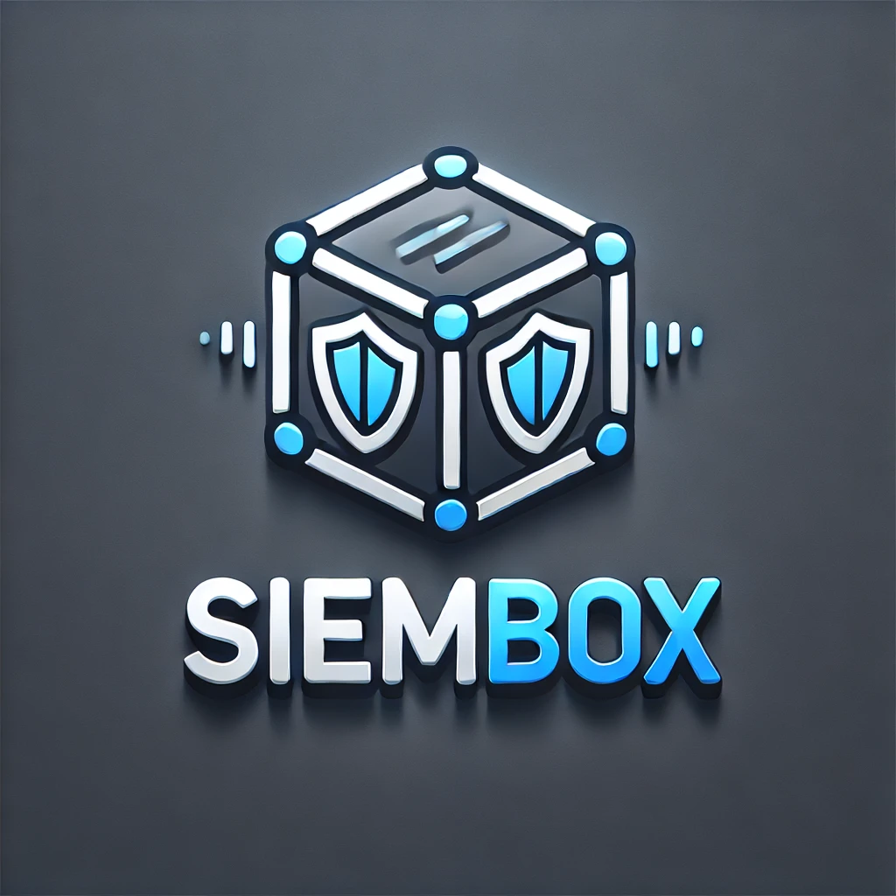

# SIEMBox

Realtime security monitoring and threat detection for your infrastructure. Built with Docker.

## Overview

SIEMBox is a containerized, microservice-based Security Information and Event Management (SIEM) system designed to provide real-time monitoring, threat detection using Sigma rules, and security analytics for your infrastructure.

## Features

*   **Log Collection:** Ingests logs via Syslog (TCP/UDP) and HTTP. Supports CEF, JSON, and plain text formats.
*   **Threat Detection:** Utilizes the Sigma standard for rule-based threat detection. Rules are automatically updated from the SigmaHQ repository.
*   **IP Intelligence:** Enriches logs with IP geolocation and threat information (requires optional API keys).
*   **VPS Security Auditing:** Performs scheduled security audits on configured remote servers via SSH.
*   **Web Interface:** Provides a dashboard for viewing logs, alerts, rule status, and system settings.
*   **API:** Offers a RESTful API for integration and interaction with system components.

## Getting Started

Follow these steps to get SIEMBox running locally using Docker and pre-built images.

**Prerequisites:**

*   Docker: [Install Docker](https://docs.docker.com/get-docker/)
*   Docker Compose: Usually included with Docker Desktop. If not, [Install Docker Compose](https://docs.docker.com/compose/install/).

**Steps:**

1.  **Create a directory for SIEMBox:**
    ```bash
    mkdir siembox
    cd siembox
    ```

2.  **Download Configuration Files:**
    Download the `docker-compose.yml` and `.env.example` files from the repository. You can do this manually or using commands like `curl`:
    ```bash
    curl -o docker-compose.yml https://raw.githubusercontent.com/cladkins/siembox/main/docker-compose.yml
    curl -o .env.example https://raw.githubusercontent.com/cladkins/siembox/main/.env.example
    ```
    *(Note: Replace `main` with the appropriate branch or tag if necessary)*

3.  **Configure Environment Variables:**
    Copy the example environment file and edit it with your specific settings.
    ```bash
    cp .env.example .env
    ```
    *   **Important:** You **must** set secure values for `DB_PASSWORD`, `JWT_SECRET`, and `ENCRYPTION_KEY` in the `.env` file.
    *   Review other variables in `.env` for optional API keys (like `IPAPI_KEY`, `CROWDSEC_API_KEY`) or custom port configurations.

4.  **Pull Pre-built Images:**
    Fetch the latest service images from the container registry.
    ```bash
    docker-compose pull
    ```

5.  **Start the containers:**
    This command will start all the SIEMBox services using the pre-built images.
    ```bash
    docker-compose up -d
    ```

6.  **Access the Dashboard:**
    Once the containers are up and running, you can access the web interface, typically at: `http://localhost:3000` (or the port configured via `FRONTEND_PORT` in your `.env` file).

*(Optional) For Development:* If you intend to modify the source code, clone the full repository instead (`git clone https://github.com/cladkins/siembox.git`) and follow the steps in the original README version (which will trigger local builds).

## Documentation

For more detailed technical documentation, architecture diagrams, and API specifications, please refer to the [SIEMBox GitHub Wiki](https://github.com/cladkins/siembox/wiki) (link assumes wiki is enabled/used).

## License

This project is licensed under the MIT License.
