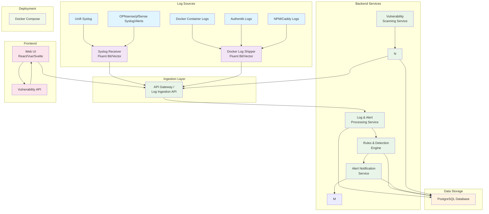

# SIEMBox Architecture Diagram

## High-Level System Architecture

This diagram represents the high-level architecture of the SIEMBox project, showing component relationships and data flow within the system.

### Key Architectural Context

- **Log Sources**: Various syslog and container log inputs
- **Ingestion Layer**: Log collection and forwarding using Fluent Bit/Vector
- **Backend Services**: Core processing, detection, and notification services
- **Data Storage**: PostgreSQL database for logs, alerts, and vulnerability data
- **Frontend**: Web UI for monitoring and management
- **Deployment**: Docker Compose orchestration

### Component Relationships

The system follows a layered architecture where:
1. Log sources feed into ingestion components
2. Ingestion layer forwards to API Gateway
3. Backend services process and analyze data
4. All services persist data to PostgreSQL
5. Frontend provides user interface and API access
6. Docker Compose manages the entire deployment

## Implementation Notes

### Log Sources
- **Unifi Syslog**: Network device logs from Ubiquiti equipment
- **OPNsense/pfSense**: Firewall and network security logs
- **Docker Container Logs**: Application and service logs from containers
- **Authentik Logs**: Identity and access management logs
- **NPM/Caddy Logs**: Reverse proxy and web server logs

### Ingestion Layer
- **Syslog Receiver**: Collects syslog messages from network devices
- **Docker Log Shipper**: Collects logs from Docker containers
- Both use Fluent Bit or Vector for efficient log processing

### Backend Services
- **API Gateway**: Central entry point for all log ingestion
- **Log & Alert Processing**: Normalizes and enriches log data
- **Rules & Detection Engine**: Applies security rules and threat detection
- **Alert Notification Service**: Manages alert distribution
- **Vulnerability Scanning Service**: Performs security assessments

### Data Storage
- **PostgreSQL**: Primary database for all system data
- Stores logs, alerts, vulnerability scans, and configuration

### Frontend
- **Web UI**: Modern web interface for monitoring and management
- **Vulnerability API**: REST API for vulnerability data access

### Deployment
- **Docker Compose**: Orchestrates all services in containers

## Development Guidelines

When implementing components, refer to this diagram to ensure:
1. Proper data flow between components
2. Correct service dependencies
3. Appropriate API interfaces
4. Consistent deployment structure

This architecture supports scalability, maintainability, and security best practices for a SIEM system. 