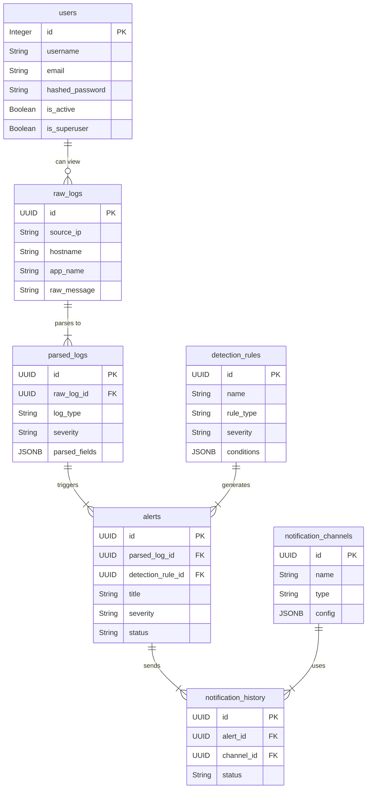

# SIEMBox - Database Schema Documentation

This document provides a comprehensive overview of the SIEMBox database schema, detailing the structure of each table, their relationships, and key indexing strategies.

## 1. Overview

SIEMBox uses PostgreSQL as its primary database, leveraging its powerful features for performance and flexibility. The schema is defined using SQLAlchemy 2.0 and is designed to support the asynchronous, high-performance requirements of the application.

### Key Features

-   **Asynchronous Support**: The schema is fully compatible with `asyncpg` for non-blocking database operations.
-   **Standardized Data Types**: Custom type decorators ensure platform-independent data types for `UUID`, `INET`, and `JSONB`.
-   **Clear Relationships**: Foreign key constraints and SQLAlchemy relationships enforce data integrity.

## 2. Entity Relationship Diagram (ERD)

## 3. Core Tables

### `users`

Stores user authentication and authorization information.

| Column          | Type      | Constraints      | Description                            |
| --------------- | --------- | ---------------- | -------------------------------------- |
| `id`            | `Integer` | **Primary Key**  | Unique identifier for the user.        |
| `username`      | `String`  | **Unique**       | The user's login name.                 |
| `email`         | `String`  | **Unique**       | The user's email address.              |
| `hashed_password` | `String`  |                  | The user's hashed password.            |
| `is_active`     | `Boolean` | `default: True`  | Whether the user's account is active.  |
| `is_superuser`  | `Boolean` | `default: False` | Whether the user has admin privileges. |

### `raw_logs`

Stores unprocessed log entries as they are ingested.

| Column        | Type     | Constraints     | Description                               |
| ------------- | -------- | --------------- | ----------------------------------------- |
| `id`          | `UUID`   | **Primary Key** | Unique identifier for the raw log.        |
| `source_ip`   | `INET`   |                 | The IP address of the log source.         |
| `hostname`    | `String` |                 | The hostname of the log source.           |
| `app_name`    | `String` |                 | The name of the application or service.   |
| `raw_message` | `Text`   |                 | The complete, unprocessed log message.    |

### `parsed_logs`

Stores structured log data after parsing.

| Column          | Type    | Constraints                               | Description                               |
| --------------- | ------- | ----------------------------------------- | ----------------------------------------- |
| `id`            | `UUID`  | **Primary Key**                           | Unique identifier for the parsed log.     |
| `raw_log_id`    | `UUID`  | **Foreign Key** (`raw_logs.id`)           | A reference to the original raw log.      |
| `log_type`      | `String`|                                           | The type of log (e.g., `firewall`, `auth`). |
| `severity`      | `String`|                                           | The severity level of the log.            |
| `parsed_fields` | `JSONB` |                                           | The structured data extracted from the log. |

### `detection_rules`

Stores the rules used to detect security events.

| Column       | Type     | Constraints     | Description                               |
| ------------ | -------- | --------------- | ----------------------------------------- |
| `id`         | `UUID`   | **Primary Key** | Unique identifier for the rule.           |
| `name`       | `String` |                 | The human-readable name of the rule.      |
| `rule_type`  | `String` |                 | The type of rule (e.g., `threshold`).     |
| `severity`   | `String` |                 | The severity of alerts generated by the rule. |
| `conditions` | `JSONB`  |                 | The logic and conditions of the rule.     |

### `alerts`

Stores the security alerts generated by detection rules.

| Column              | Type     | Constraints                               | Description                               |
| ------------------- | -------- | ----------------------------------------- | ----------------------------------------- |
| `id`                | `UUID`   | **Primary Key**                           | Unique identifier for the alert.          |
| `parsed_log_id`     | `UUID`   | **Foreign Key** (`parsed_logs.id`)        | A reference to the parsed log that triggered the alert. |
| `detection_rule_id` | `UUID`   | **Foreign Key** (`detection_rules.id`)    | A reference to the rule that generated the alert. |
| `title`             | `String` |                                           | The title of the alert.                   |
| `severity`          | `String` |                                           | The severity level of the alert.          |
| `status`            | `String` | `default: 'open'`                         | The current status of the alert.          |

### `notification_channels`

Stores the configuration for notification channels.

| Column   | Type     | Constraints     | Description                               |
| -------- | -------- | --------------- | ----------------------------------------- |
| `id`     | `UUID`   | **Primary Key** | Unique identifier for the channel.        |
| `name`   | `String` |                 | The human-readable name of the channel.   |
| `type`   | `String` |                 | The type of channel (e.g., `email`, `slack`). |
| `config` | `JSONB`  |                 | The configuration for the channel.        |

### `notification_history`

Stores a record of all notifications sent.

| Column     | Type     | Constraints                             | Description                               |
| ---------- | -------- | --------------------------------------- | ----------------------------------------- |
| `id`       | `UUID`   | **Primary Key**                         | Unique identifier for the history record. |
| `alert_id` | `UUID`   | **Foreign Key** (`alerts.id`)           | A reference to the alert that was sent.   |
| `channel_id` | `UUID` | **Foreign Key** (`notification_channels.id`) | A reference to the channel used.          |
| `status`   | `String` | `default: 'pending'`                    | The delivery status of the notification.  |