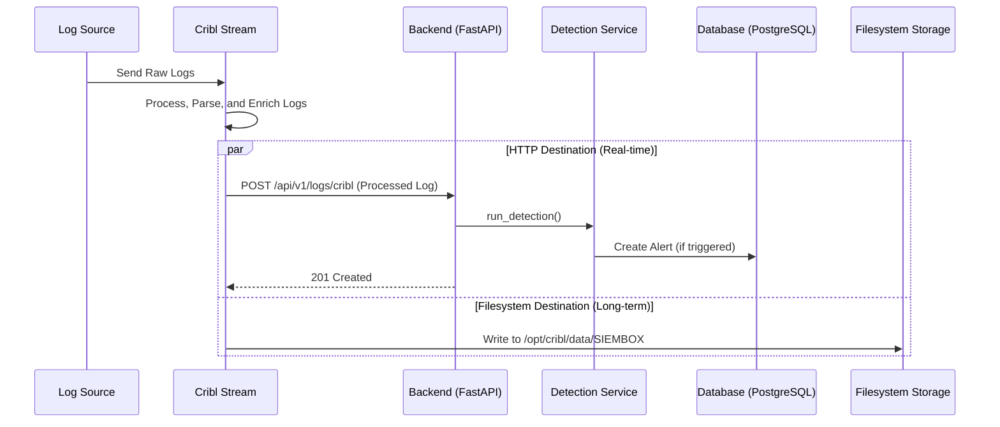
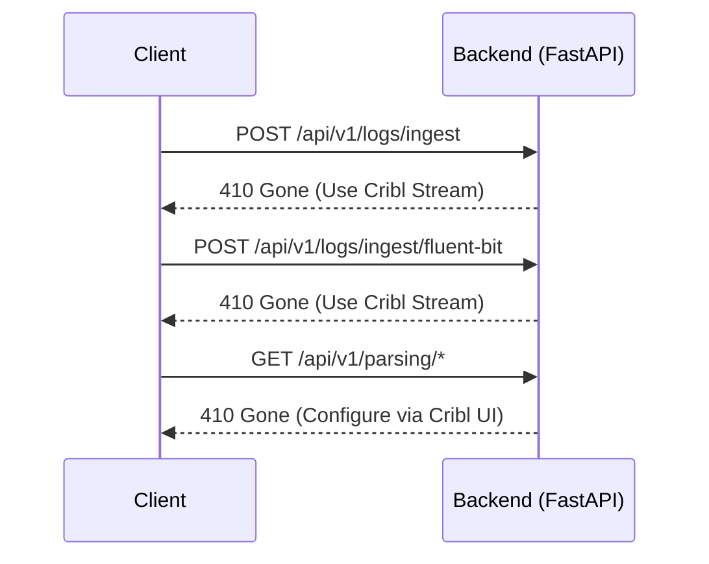
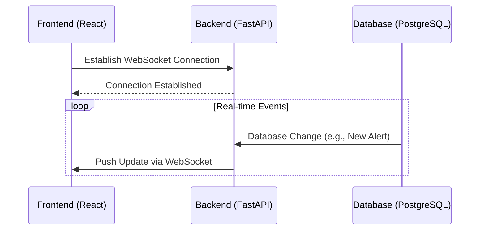

# SIEMBox - Service Architecture Documentation

This document provides a comprehensive overview of the SIEMBox service architecture, detailing its components, data flow, and design principles.

## 1. Overview

SIEMBox is built on a modern **Pattern B** architecture with Cribl Stream integration, designed for performance, scalability, and maintainability. The system is container-native, API-first, and uses a hybrid approach where Cribl handles log processing while PostgreSQL manages metadata, alerts, and configuration.

### Design Principles

-   **Asynchronous by Default**: All I/O-bound operations are handled asynchronously, ensuring the application remains responsive under load.
-   **Unified Backend**: A single FastAPI application handles all backend logic, from API requests to log processing and alert generation, simplifying deployment and maintenance.
-   **Scalability**: The stateless nature of the backend allows for easy horizontal scaling.
-   **Modularity**: The codebase is organized into distinct services, promoting separation of concerns and maintainability.

## 2. System Architecture

The architecture implements **Pattern B** with four primary components: a frontend web application, a unified backend service, Cribl Stream for log processing, and a PostgreSQL database for metadata.

### High-Level Architecture Diagram

```mermaid
graph TD
    subgraph "User Interface"
        A[Frontend (React)]
    end

    subgraph "Backend Infrastructure"
        B[Backend (FastAPI)]
        C[Database (PostgreSQL)]
    end

    subgraph "Log Processing Layer"
        F[Cribl Stream]
        G[Filesystem Storage]
    end

    A -- HTTP/WebSocket --> B
    B -- Async SQLAlchemy --> C
    B -- JWT API --> F

    subgraph "External Integrations"
        D[Log Sources (Syslog, Docker, etc.)]
        E[Notification Channels (Email, Slack, etc.)]
    end

    D -- Raw Logs --> F
    F -- HTTP Destination --> B
    F -- Filesystem Destination --> G
    B -- Alert Notifications --> E
```

## 3. Component Details

### Frontend Service

-   **Technology**: React 18, TypeScript, Vite
-   **Responsibilities**:
    -   Provides the user interface for interacting with the SIEMBox system.
    -   Communicates with the backend via a REST API.
    -   Receives real-time updates via WebSocket connections.

### Backend Service

-   **Technology**: FastAPI, Python 3.11+, SQLAlchemy 2.0 (async), Pydantic, httpx
-   **Responsibilities**:
    -   **API Endpoints**: Exposes a comprehensive REST API for all system functionality.
    -   **Authentication & Authorization**: Manages user authentication and role-based access control.
    -   **Cribl Integration**: Direct API communication with Cribl Stream using JWT authentication.
    -   **Asynchronous Services**: Integrates core business logic into a unified service layer:
        -   **Cribl Service**: Handles communication with Cribl Stream API for configuration and health checks.
        -   **Detection Service**: Applies detection rules to processed logs from Cribl.
        -   **Alert Service**: Manages the lifecycle of alerts.
        -   **Notification Service**: Sends notifications to external channels.
    -   **Database Interaction**: Manages metadata, alerts, and configuration in PostgreSQL.

### Log Processing Service

-   **Technology**: Cribl Stream
-   **Responsibilities**:
    -   **Dual Destination Architecture**:
        - **HTTP Destination**: Real-time log forwarding to backend `/api/v1/logs/cribl` endpoint
        - **Filesystem Destination**: Long-term storage to `/opt/cribl/data/SIEMBOX` with persistent volumes
    -   **Log Processing**: Receives, processes, enriches, and routes logs using pipeline-based engine.
    -   **Source Management**: Handles multiple input sources (Syslog, HTTP, Docker logs).
    -   **Authentication**: JWT token-based API access for backend integration.
    -   **Configuration API**: Provides REST API for managing inputs, outputs, and pipelines.

### Database Service

-   **Technology**: PostgreSQL 15+
-   **Responsibilities**:
    -   **Metadata Storage**: Stores alerts, detection rules, user information, and system configuration.
    -   **No Raw Logs**: Raw log data is handled by Cribl Stream (Pattern B architecture).
    -   **Parsed Log Metadata**: Stores parsed log metadata and references for correlation.
    -   **Data Integrity**: Ensures consistency with ACID transactions for critical system data.

## 4. Data Flow Patterns

### Pattern B Log Processing Flow



### Deprecated Endpoints Flow



### Real-Time Update Flow (WebSockets)



## 5. Scalability and Performance

-   **Horizontal Scaling**: The stateless backend can be scaled horizontally by running multiple instances behind a load balancer.
-   **Connection Pooling**: SQLAlchemy's async connection pool is used to efficiently manage database connections.
-   **Asynchronous Operations**: The non-blocking nature of the async architecture allows the backend to handle a high number of concurrent requests and background tasks efficiently.