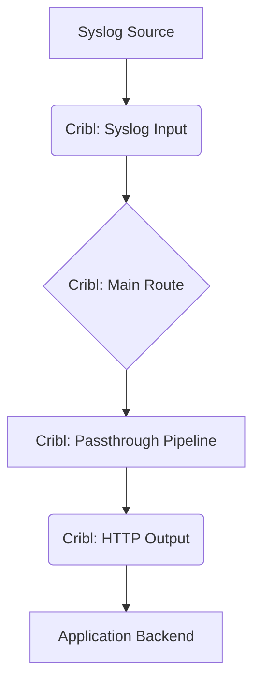

# Cribl Remediation Plan

## 1. Executive Summary

The current Cribl implementation is critically flawed, suffering from incorrect architectural dependencies, misconfigured file paths, and a fundamental misunderstanding of Cribl's role. This plan outlines the necessary steps to re-architect the data pipeline into a robust, maintainable, and scalable solution.

The core of the problem lies in the tight coupling of the Cribl ingestion service with the application backend, which is an anti-pattern that guarantees data loss. The remediation will focus on decoupling these services and establishing a simple, resilient data flow.

## 2. Identified Problems

1.  **Architectural Flaw: Backend Dependency:** Cribl's dependency on the backend in `docker-compose.yml` is the most critical issue. The log ingestion pipeline must be independent.
2.  **Misconfigured Cribl Volumes:** The `docker-compose.yml` volume mount for Cribl configuration is incorrect, pointing to `.../config` instead of `.../local`.
3.  **Misplaced Cribl Routing Logic:** The routing configuration is incorrectly located in `pipelines/route.yml` instead of a root `routes.yml`.
4.  **Inefficient "Pass-Through" Pipeline:** The current setup uses a single, inefficient route that sends all data directly to the backend without any processing.
5.  **Risky Backpressure Handling:** The `onBackpressure: block` setting in `outputs.yml` will cause the entire pipeline to halt if the backend is unavailable, leading to data loss.
6.  **Misuse of Cribl API:** The `cribl_service.py` attempts to query Cribl for logs, which is not its intended function.
7.  **Hardcoded Credentials:** The `cribl_service.py` contains hardcoded credentials, posing a significant security risk.

## 3. Remediation Steps

### Step 1: Decouple Services in `docker-compose.yml`

-   **Action:** In `docker-compose.yml`, remove the `depends_on` block from the `cribl` service definition.
-   **Rationale:** This makes the Cribl ingestion pipeline independent of the backend, ensuring that log collection continues even if the backend is down.

### Step 2: Correct Cribl Configuration and File Structure

-   **Action 1: Fix Volume Mount:** In `docker-compose.yml`, change the `cribl` volume from `./ingestion_agents/cribl/config:/opt/cribl/config` to `./ingestion_agents/cribl/local:/opt/cribl/local`.
-   **Action 2: Create `routes.yml`:** Create a new file `ingestion_agents/cribl/local/cribl/routes.yml` with the correct routing logic.
-   **Action 3: Create `passthrough.yml`:** Rename `ingestion_agents/cribl/local/cribl/pipelines/route.yml` to `passthrough.yml` and simplify it to be a true passthrough pipeline.
-   **Rationale:** This ensures that Cribl loads the correct configuration files from the correct locations.

### Step 3: Implement Resilient Output

-   **Action:** In `ingestion_agents/cribl/local/cribl/outputs.yml`, change `onBackpressure: block` to `onBackpressure: "queue"` and enable the persistent queue by adding `pqEnabled: true`.
-   **Rationale:** This prevents data loss by queuing data when the backend is unavailable, rather than blocking the entire pipeline.

### Step 4: Refactor the Backend `cribl_service.py`

-   **Action 1: Remove Deprecated Functions:** Delete the `get_logs_with_filters`, `get_log_stats`, and `get_log_by_id` methods from `cribl_service.py`.
-   **Action 2: Externalize Credentials:** Replace the hardcoded username and password with environment variables loaded from the application's settings.
-   **Rationale:** This aligns the backend service with Cribl's actual capabilities and removes a significant security vulnerability.

## 4. Proposed Data Flow

The remediated data flow will be simple and robust:

This architecture ensures that Cribl's role is properly limited to data ingestion and routing, while the backend handles storage and querying.